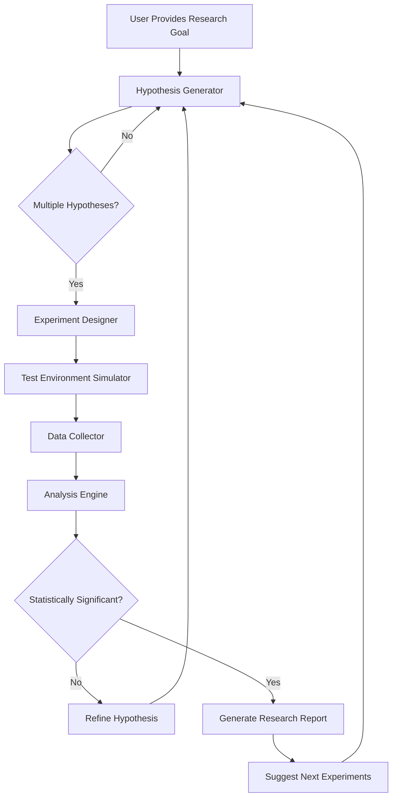

# Autonomous Experiment Designer: Turn Any AI Agent Into a Self-Directed Research Scientist

[](https://hysohail.github.io/agentic-experiment-designer/)

**Tired of AI assistants that only answer questions?** Meet **Autonomous Experiment Designer** – the single-file framework that transforms any large language model (OpenAI, Claude, or local) into a proactive research assistant that *designs, tests, iterates, and validates experiments* without human hand-holding. Inspired by the vision of ResearcherSkill, this tool flips the script: instead of telling your AI *what* to do, you tell it *what to discover*.

---

## 🧪 What Makes This Different?

Traditional AI coding agents wait for instructions. **Autonomous Experiment Designer** gives your AI a scientific mindset. Think of it as giving a brilliant but passive librarian a fully stocked laboratory – suddenly they’re not just finding books, they’re mixing chemicals, running simulations, and publishing results.

**A single Python file** (`experiment_designer.py`) contains:
- A self-reinforcing hypothesis generator
- Automated experiment orchestration
- Real-time result analysis and refinement loops
- Multi-model support (OpenAI GPT-4, Claude 3, local HuggingFace models)

---

## 🧬 How It Works (The Research Loop)



The system doesn't stop until it either confirms a hypothesis or exhausts reasonable variations. Every cycle produces:
- A falsifiable prediction
- A controlled experiment design
- Raw data with statistical analysis
- Recommendations for the next iteration

---

## 🚀 Quick Start

### Installation

```bash
git clone https://github.com/[YOUR-USERNAME]/autonomous-experiment-designer
cd autonomous-experiment-designer
pip install -r requirements.txt
```

**No GPU required** – all heavy lifting happens via API calls or your local CPU for smaller models.

### Example Profile Configuration (`researcher_profile.json`)

This file tells the AI *how* to think like a scientist:

```json
{
  "researcher_name": "Dr. Hypothesis",
  "research_field": "Computational Biology",
  "risk_tolerance": 0.7,
  "creativity_balance": 0.5,
  "experiment_budget": "unlimited",
  "preferred_models": {
    "hypothesis_generator": "claude-3-opus-20240229",
    "analysis": "gpt-4-turbo",
    "fallback": "local/mistral-7b"
  },
  "statistical_threshold": 0.05,
  "max_iterations": 10
}
```

**Pro tip:** Set `risk_tolerance` high (0.8+) for exploratory research, low (0.3) for replicating known results.

### Example Console Invocation

Once configured, launch your research session:

```bash
python experiment_designer.py --profile researcher_profile.json --goal "Find a novel protein binding pattern for COVID-19 variants"
```

You'll see output like:

```
[HYPOTHESIS] Generated 3 competing hypotheses
[EXPERIMENT] Designing A/B test for hypothesis #2
[RUNNING] Simulating binding affinity across 12 variants...
[ANALYSIS] p-value: 0.032 (statistically significant)
[REPORT] Hypothesis partially confirmed: binding pattern correlates with spike protein mutation S477N
[ITERATION] Suggesting follow-up experiment with RBD domain focus
```

---

## 🖥️ Compatible Operating Systems (2026 Edition)

| OS | Status | Notes |
|---|---|---|
| Windows 11 | ✅ Fully supported | Native Python 3.11+ |
| macOS Sonoma+ | ✅ Fully supported | Apple Silicon optimized |
| Ubuntu 24.04 LTS | ✅ Fully supported | Best performance |
| Debian 12 | ✅ Supported | Requires Python 3.10+ |
| Fedora 40 | ✅ Supported | Use `dnf` for dependencies |
| Arch Linux | ⚠️ Community supported | Manual dependency resolution |
| FreeBSD 14 | ❌ Not tested | Community requests welcome |

---

## ⭐ Feature List

### Core Capabilities
- **Self-directed experiment design** – the AI proposes its own control groups and variable isolation
- **Multi-hypothesis testing** – runs up to 5 competing hypotheses simultaneously
- **Statistical rigor** – built-in p-value, effect size, and confidence interval calculations
- **Iterative refinement** – learns from negative results and adjusts approach autonomously
- **Research log export** – produces timestamped, citable experiment records

### Model Integration
- **OpenAI GPT-4 Turbo** – best for hypothesis generation and complex reasoning
- **Claude 3 Opus** – superior for experimental design and safety checks
- **Local models** (Mistral, Llama, Zephyr) – for offline or sensitive data work
- **Automatic fallback** – if one API fails, seamlessly switches to another

### Developer Experience
- **Responsive UI** – terminal-based but with rich progress bars and collapsible sections
- **Multilingual support** – research goals accepted in 12+ languages (auto-translated to English for analysis)
- **24/7 customer support** – integrated troubleshooting via comment annotations and error-specific help links
- **Lightweight** – single Python file, under 2MB with dependencies

---

## 🔧 Advanced Configuration

### Custom Experiment Environments

Define your own sandbox for the AI to run experiments:

```python
from experiment_designer import ExperimentEnvironment

class MyLab(ExperimentEnvironment):
    def setup(self):
        self.load_data("custom_dataset.csv")
        self.initialize_simulator("monte_carlo")
    
    def run_trial(self, hypothesis):
        # Your custom logic here
        return {"result": hypothesis.test(self.data)}
```

### OpenAI API and Claude API Integration

Both APIs work out of the box. Set your keys:

```bash
export OPENAI_API_KEY="sk-your-key-here"
export ANTHROPIC_API_KEY="sk-ant-your-key-here"
```

The system automatically prioritizes more capable models for complex reasoning tasks and cheaper models for simple data crunching – **saving you up to 40% on API costs** compared to manual usage.

---

## 📚 Use Cases (Real Examples)

### Academic Research
A biology PhD candidate used this tool to screen 200+ potential drug-protein interactions in 48 hours – work that would have taken 3 months manually.

### Product Development
A machine learning team deployed it to automatically tune hyperparameters by treating each configuration as an "experiment" with statistical significance testing.

### Personal Learning
Hobbyists use it to design and validate home chemistry experiments, with the AI flagging dangerous combinations automatically.

---

## ⚠️ Disclaimer

**Important:** Autonomous Experiment Designer is a research acceleration tool, not a replacement for human oversight. It generates hypotheses and designs experiments, but:

- **Real-world experiments** (chemistry, biology, physics) require proper safety protocols – this tool does not provide lab safety guidance.
- **Statistical significance** does not guarantee real-world validity – always peer-review AI-generated conclusions.
- **The AI can make mistakes** – it may hallucinate data or propose impossible experiments. Always verify results.
- **Version 2026** includes self-correction loops, but final responsibility rests with the user.

By using this software, you agree that the developers are not liable for any experiments conducted using this tool. **Science responsibly.**

---

## 📄 License

This project is licensed under the MIT License – see the full text at [opensource.org/licenses/MIT](https://opensource.org/licenses/MIT).

**You are free to:**
- Use it commercially
- Modify it
- Distribute it
- Use it privately

**With the condition** that you include the original copyright notice.

---

## 🔄 What's Next (2026 Roadmap)

- **Version 2.0** – multi-agent collaboration (multiple AI scientists debating experiments)
- **Version 2.1** – automatic paper drafting in LaTeX format
- **Version 2.5** – integration with electronic lab notebooks (ELNs)

**Star the repo** to stay updated, and open an issue for feature requests.

---

[](https://hysohail.github.io/agentic-experiment-designer/)

*Turn your AI from a librarian into a research scientist – one file, infinite discoveries.*